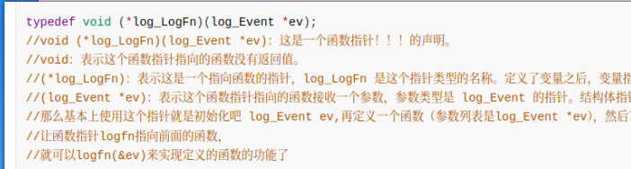
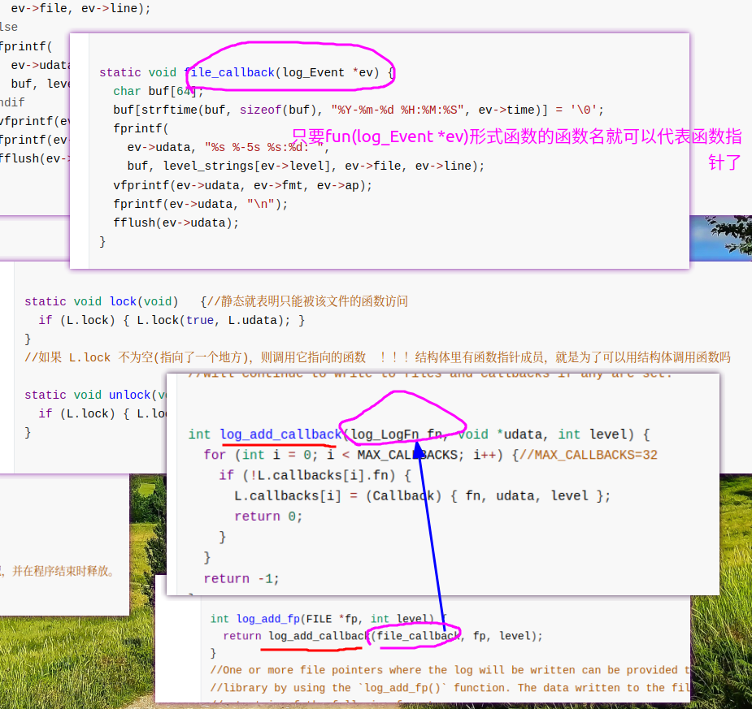

# 解读方式

下次遇到复杂的项目

先通读全文，读到不懂的问题 只要能弄懂逻辑在做什么就行 具体的实现细节先不用管

截图固定到桌面方便看代码


# 下次是不是应该先看第一版本，再慢慢加入别的功能 多线程  锁？？


# 后面还要再多了解 回调函数和函数指针的通用用途？？

https://kimi.moonshot.cn/chat/cv4gkjgnnlr81kubhgjg

# 问题

## ！！核心功能实现 

如果没有添加回调函数，`log_log` 的主要功能是将日志输出到标准错误（`stderr`）。

### stdout_callback

```c
static void stdout_callback(log_Event *ev) {
  char buf[16];
  buf[strftime(buf, sizeof(buf), "%H:%M:%S", ev->time)] = '\0';//buf 中由 strftime 写入的最后一个字符的下一个位置设置为字符串终止符 '\0'
#ifdef LOG_USE_COLOR
  fprintf(//传到这里的udata就是stderr了
    ev->udata, "%s %s%-5s\x1b[0m \x1b[90m%s:%d:\x1b[0m ",
    buf, level_colors[ev->level], level_strings[ev->level],
    ev->file, ev->line);// 函数把一个字符串写入到文件中 不是直接打印吗
#else
  fprintf(
    ev->udata, "%s %-5s %s:%d: ",
    buf, level_strings[ev->level], ev->file, ev->line);
#endif
  vfprintf(ev->udata, ev->fmt, ev->ap);
  fprintf(ev->udata, "\n");
  fflush(ev->udata);
}
```


#### strftime

```c
	size_t strftime(char *str, size_t maxsize, const char *format, const struct tm *timeptr)
根据 format 中定义的格式化规则，格式化结构 timeptr 表示的时间，并把它存储在 str 中。
```


参数

- **str** -- 这是指向目标数组的指针，用来复制产生的 C 字符串。
- **maxsize** -- 这是被复制到 str 的最大字符数。
- **format** -- 这是 C 字符串，包含了普通字符和特殊格式说明符的任何组合。这些格式说明符由函数替换为表示 tm 中所指定时间的相对应值。格式说明符是：

maxsize 一般就sizeof就行  或者定大一点

format Y m d H M S


返回值

如果产生的 C 字符串小于 size 个字符（包括空结束字符），则会返回复制到 str 中的字符总数（不包括空结束字符），否则返回零。


**在这之前已经**

```
time_t t = time(NULL);
    ev->time = localtime(&t);
```


#### fprintf


#### vfprintf


#### fflush

### file_callback


```c
static void file_callback(log_Event *ev) {//叫他回调函数可能是因为他实现了typedef void (*log_LogFn)(log_Event *ev);
    //所以可以把这个函数名作为函数指针传递给log_add_callback
  char buf[64];
  buf[strftime(buf, sizeof(buf), "%Y-%m-%d %H:%M:%S", ev->time)] = '\0';
  fprintf(
    ev->udata, "%s %-5s %s:%d: ",
    buf, level_strings[ev->level], ev->file, ev->line);
  vfprintf(ev->udata, ev->fmt, ev->ap);
  fprintf(ev->udata, "\n");
  fflush(ev->udata);
}
```


## stderr stdout到底是什么 文件、屏幕都行

log_set_level当前的日志级别可以通过调用 log_set_level() 函数来设置。所有低于指定级别的日志都不会被写入到 stderr

stderr是什么？？？   文件还是输出到屏幕  答：都行


**stderr、stdin** 和 **stdout**
这些宏是指向 FILE 类型的指针，分别对应于标准错误、标准输入和标准输出流。

标准文件

C 语言把所有的设备都当作文件。所以设备（比如显示器）被处理的方式与文件相同。以下三个文件会在程序执行时自动打开，以便访问键盘和屏幕。

| 标准文件 | 文件指针 | 设备     |
| :------- | :------- | :------- |
| 标准输入 | stdin    | 键盘     |
| 标准输出 | stdout   | 屏幕     |
| 标准错误 | stderr   | 您的屏幕 |

stderr默认是屏幕输出，所以这里就是打印到终端，也可以重定向到文件


**问：**

根据我给你的代码，告诉我,stdout_callback，其中结构体ev->udata指向的是stderr对吧，这个stderr在这个例子里是不是输出到屏幕，stderr除了屏幕还能是什么


#### `stderr` 的默认行为

- 在你的代码中，`stdout_callback` 的 `ev->udata` 默认指向 `stderr`。
- `stderr` 是标准错误流，通常用于输出错误信息或调试信息。
- 在大多数操作系统中，`stderr` 的**默认输出目标是屏幕（终端或控制台）。**

#### `stderr` 的其他可能目标

虽然 `stderr` 默认输出到屏幕，但你可以通过以下方式将 `stderr` 重定向到其他目标：

1. **重定向到文件**
   在命令行中运行程序时，可以将 `stderr` 重定向到文件：

   bash复制

   ```bash
   ./my_program 2>error.log
   ```

   这会将所有写入 `stderr` 的内容保存到 `error.log` 文件中。

2. **重定向到其他流**
   在程序中，可以通过 `freopen` 函数将 `stderr` 重定向到其他文件：

   c复制

   ```c
   freopen("error.log", "w", stderr);
   ```

   之后，所有写入 `stderr` 的内容都会输出到 `error.log` 文件中。

3. **管道或设备**
   在某些系统中，`stderr` 也可以被重定向到管道或其他设备（如 `/dev/null`，用于丢弃输出）：

   bash复制

   ```bash
   ./my_program 2>/dev/null
   ```


是的，`stdin` 和 `stdout` 也可以像 `stderr` 一样被重定向。它们都是标准 I/O 流，分别用于输入、标准输出和错误输出。在操作系统层面，这些流可以通过命令行或程序内部进行重定向。

### 1. **命令行重定向**

在命令行中，可以使用符号 `<`、`>` 和 `2>` 来重定向 `stdin`、`stdout` 和 `stderr`。

#### 示例：

```bash
# 将 stdin 重定向到文件
./my_program < input.txt

# 将 stdout 重定向到文件
./my_program > output.txt

# 将 stderr 重定向到文件
./my_program 2> error.log

# 将 stdout 和 stderr 合并到同一个文件
./my_program > output.txt 2>&1
```

- `<`：将文件内容作为输入传递给程序。
- `>`：将标准输出重定向到文件。
- `2>`：将标准错误重定向到文件。
- `2>&1`：将标准错误重定向到标准输出（通常用于将错误和普通输出合并到同一个文件）。

### 2. **程序内部重定向**

在 C 语言中，可以使用 `freopen` 函数动态地重定向 `stdin`、`stdout` 和 `stderr`。

#### 示例：

```c
#include <stdio.h>

int main() {
    // 将 stdin 重定向到文件
    freopen("input.txt", "r", stdin);

    // 将 stdout 重定向到文件
    freopen("output.txt", "w", stdout);

    // 将 stderr 重定向到文件
    freopen("error.log", "w", stderr);

    // 从 stdin 读取内容
    char buffer[100];
    if (fgets(buffer, sizeof(buffer), stdin)) {
        printf("Read from stdin: %s", buffer);
    }

    // 输出到 stdout
    printf("This will go to output.txt\n");

    // 输出到 stderr
    fprintf(stderr, "This will go to error.log\n");

    return 0;
}
```

### 3. **`stdin`、`stdout` 和 `stderr` 的用途**

- **`stdin`**：标准输入流，默认从键盘读取输入。通常用于接收用户输入。
- **`stdout`**：标准输出流，默认输出到屏幕。通常用于显示程序的正常输出。
- **`stderr`**：标准错误流，默认输出到屏幕。通常用于显示错误信息或调试信息。

### 4. **重定向的用途**

- **日志记录**：将 `stdout` 或 `stderr` 重定向到文件，方便记录程序的输出或错误信息。
- **自动化测试**：将输入从文件读取，输出到文件，便于测试程序的输入输出行为。
- **资源管理**：将输出重定向到 `/dev/null`（在 Unix 系统中），丢弃不需要的输出。

### 总结

- `stdin`、`stdout` 和 `stderr` 都可以通过命令行或程序内部进行重定向。
- 重定向的用途包括日志记录、自动化测试和资源管理。
- 在程序中，可以使用 `freopen` 函数动态地改变这些流的目标。


## stdin、stdout、stderr详解

**是什么**

`stdin` 是一个指向输入流的文件指针，用于从外部源（通常是键盘）读取数据

- **类型**：`FILE *stdin`，定义在 `<stdio.h>` 中。

`stdout` 是一个指向输出流的文件指针，用于将程序的正常输出发送到外部环境（通常是屏幕）。

`stderr` 是一个指向错误输出流的文件指针，专门用于输出错误信息或警告信息。


C**语言中的文件描述符**

在底层实现中，`stdin`、`stdout` 和 `stderr` 分别对应文件描述符（file descriptor）：

- **`stdin`** 对应文件描述符 **`0`**。
- **`stdout`** 对应文件描述符 **`1`**。
- **`stderr`** 对应文件描述符 **`2`**。

这些文件描述符是操作系统层面的概念，用于管理文件和I/O流。C标准库通过文件指针（`FILE *`）封装了这些文件描述符，使得程序员可以更方便地进行输入输出操作。


### 问答：

**是否可以关闭这些流，可以**

- 在C语言中，**可以关闭** `stdin`、`stdout` 和 `stderr`，就像关闭普通文件流一样，使用 `fclose()` 函数。例如：

  c复制

  ```c
  fclose(stdin);  // 关闭标准输入
  fclose(stdout); // 关闭标准输出
  fclose(stderr); // 关闭标准错误
  ```


- **注意**：关闭这些流可能会导致程序的行为异常。例如，关闭 `stdout` 后，程序将无法再通过标准输出打印任何内容。关闭 `stdin` 后，程序将无法从标准输入读取数据。


**重新打开它们：**

- 关闭后，可以重新打开这些流。例如，可以将 `stdout` 重定向到一个文件：

  c复制

  ```c
  freopen("output.txt", "w", stdout);  // 将 stdout 重定向到文件
  printf("This will be written to output.txt\n");
  ```

- 也可以将 `stdin` 重定向到一个文件：

  c复制

  ```c
  freopen("input.txt", "r", stdin);  // 将 stdin 重定向到文件
  char buffer[100];
  fgets(buffer, sizeof(buffer), stdin);  // 从文件读取内容
  printf("Read from input.txt: %s", buffer);
  ```


---


**我能否打开看看那些文件，然后比如说我建立了一个mian.c输出内容到屏幕，而不是将stdout定向到一个文件，然后关闭程序之后，那么stdout里面还会有这次记录吗**


在C语言中，`stdout`、`stdin` 和 `stderr` 是**预定义的文件指针**，它们并不是实际的文件，而是与操作系统提供的**标准输入输出流**相关联的抽象接口。它们的行为和普通文件不同，因此不能像操作普通文件那样直接“打开”或“查看”它们的内容。


**关于你的问题**：

1. **`stdout` 是一个流（文件指针），而不是一个实际的文件**。它默认将输出发送到屏幕（终端），而不是保存到某个文件中。当你通过 `printf` 或其他函数向 `stdout` 写入内容时，这些内容会被直接发送到屏幕，而不是被存储在某个地方供后续查看。

2. **关闭程序后，`stdout` 中的内容不会被保留**。当你关闭程序时，与 `stdout` 关联的流会被关闭，所有未完成的输出操作会被完成（例如，缓冲区中的内容会被刷新到屏幕），但这些内容不会被保存下来。换句话说，`stdout` 的行为是“即时输出”，而不是“记录保存”。

3. **如果你想保留输出内容，必须显式地将输出重定向到文件**。例如：

   bash复制

   ```bash
   ./main > output.txt
   ```

   这样，`stdout` 的内容会被保存到 `output.txt` 文件中，而不是直接显示到屏幕上。之后，你可以打开 `output.txt` 文件查看内容。


**关于 `stdout` 的缓冲机制：**

- `stdout` 是一个**缓冲流**，这意味着输出内容可能会暂时**存储在内存中的缓冲区中**，直到**缓冲区被填满或显式刷新**（例如，调用 `fflush(stdout)` 或程序结束时）。
- 但是，**即使有缓冲机制，这些内容也不会被永久保存。一旦程序结束，缓冲区的内容会被清空，`stdout` 本身不会保留任何历史记录**。


---

**什么是流**

你的理解非常接近！在计算机编程中，**“流”（Stream）** 是一个非常重要的概念，它确实可以被类比为一种“临时的内存”，用于在程序和外部设备（如屏幕、键盘、文件、网络等）之间传输数据。不过，流的概念比简单的“临时内存”更广泛，它是一种抽象的接口，用于隐藏底层I/O操作的复杂性。


**1. 什么是流？**

流是一种**抽象的数据传输机制**，它允许程序以一种统一的方式处理各种输入输出操作。流可以分为两种主要类型：

- **输入流（Input Stream）**：用于从数据源（如键盘、文件、网络等）读取数据。
- **输出流（Output Stream）**：用于将数据写入目标（如屏幕、文件、网络等）。

在C语言中，流是通过 `FILE *` 类型的指针来表示的，例如 `stdin`、`stdout` 和 `stderr`。这些指针背后是由操作系统和C标准库管理的复杂机制，但对程序员来说，流提供了一个简单的接口来操作数据。

**2. 流的特性**

流的核心特性是**顺序性**和**抽象性**：

- **顺序性**：流中的数据是按顺序处理的，就像水流一样，数据从一端流入，从另一端流出。
- **抽象性**：流隐藏了底层的I/O细节。例如，程序员不需要关心数据是从磁盘读取的，还是从网络传输的，只需要通过流来操作数据。

**3. 流与临时内存的关系**

你的类比非常贴切——流确实有点像一个“临时的内存”，但它不仅仅是内存，还包含了数据的来源和去向。流的作用可以总结为以下几点：

- **缓冲区（Buffer）**：流通常会使用缓冲区来临时存储数据。例如，当你向 `stdout` 写入数据时，数据会先存储在缓冲区中，直到缓冲区满了或者程序显式地刷新缓冲区（如调用 `fflush(stdout)`），数据才会被发送到目标（如屏幕）。
- **数据传输**：流是数据传输的通道。它负责将数据从一个地方传输到另一个地方，而不需要程序员直接操作底层的硬件或文件系统。
- **抽象接口**：流提供了一种统一的接口来处理各种I/O操作。无论是从键盘读取输入，还是将数据写入文件，都可以通过流来实现。

**4. 流的分类**

在C语言中，流可以分为以下几种：

- **标准输入流（`stdin`）**：默认从键盘读取输入。
- **标准输出流（`stdout`）**：默认将输出发送到屏幕。
- **标准错误流（`stderr`）**：默认将错误信息发送到屏幕。
- **文件流**：通过 `fopen()` 打开文件后返回的流，用于读写文件。
- **其他流**：例如，网络通信也可以通过流来实现。

**5. 流的工作原理**

流的工作原理可以分为以下几个步骤：

1. **创建流**：通过函数（如 `fopen()` 或预定义的 `stdin`、`stdout`、`stderr`）创建一个流。
2. **数据传输**：使用流相关的函数（如 `printf`、`scanf`、`fread`、`fwrite` 等）在流中读写数据。
3. **缓冲机制**：流会使用缓冲区来优化数据传输。数据先存储在缓冲区中，然后批量处理。
4. **关闭流**：完成操作后，通过 `fclose()` 关闭流，释放资源。

**6. 流的缓冲机制**

流的缓冲机制是流的重要特性之一。缓冲区的作用包括：

- **提高效率**：减少对底层设备的访问次数。例如，将多个小的写操作合并为一个大的写操作。
- **临时存储**：在数据没有被发送到目标之前，缓冲区会临时保存数据。

缓冲区的大小和行为可以通过以下方式控制：

- **全缓冲（Full Buffering）**：当缓冲区满了之后才刷新。
- **行缓冲（Line Buffering）**：当遇到换行符时刷新缓冲区。
- **无缓冲（No Buffering）**：数据立即被发送，不使用缓冲区。

**7. 总结**

流是一种抽象的数据传输机制，它允许程序以统一的方式处理输入输出操作。流的作用包括：

- 提供一个简单的接口来操作数据。
- 使用缓冲区来优化数据传输。
- 隐藏底层I/O操作的复杂性。


## init_event时间库

static void init_event(log_Event *ev, void *udata) {//说白了就是赋值数据和时间
  if (!ev->time) {
    time_t t = time(NULL);
    ev->time = localtime(&t);
  }
  ev->udata = udata;
}

不用管，反正这么做就能获得时间

## 函数名作为函数指针

```c
int log_add_fp(FILE *fp, int level) {
  return log_add_callback(file_callback, fp, level);//file_callback不是一个函数吗？为什么不用括号--因为是函数名作为函数指针
}
```







## 回调函数

函数指针指向的函数就是回调函数 源自kimi的例子得到的想法   后面还要再多了解 回调函数和函数指针的通用用途


**问AI:**

根据我给你的log.h和log.c回答，什么叫回调函数，是不是比如我用log_add_callback(file_callback,fp,level)里面，吧file_callback的函数名称作为函数指针，这样一来，file_callback就叫做回调函数？回调函数的意义就是一个函数使用另一个函数名称作为函数指针来实现功能吗？回调函数的英文是什么，我要根据其原来的意思理解


**答：**

是的，你的理解基本正确。回调函数（Callback Function）是一种编程模式，其中一个函数作为参数传递给另一个函数，并在适当的时机被调用。在你的例子中，`file_callback` 就是一个回调函数。

------

### 回调函数的定义

**回调函数（Callback Function）** 是一个通过函数指针传递给另一个函数的函数。**它允许被调用的函数在执行过程中调用这个回调函数**，从而实现某种特定的功能或行为。  那理解成嵌套调用函数也行！！

在你的代码中：

```c
log_add_callback(file_callback, fp, level);
```

- `file_callback` 是一个函数。
- 它的函数名被传递给 `log_add_callback`，并存储在 `L.callbacks[i].fn` 中。
- 当 `log_log` 函数执行时，它会调用 `L.callbacks[i].fn(&ev)`，即调用 `file_callback` 函数。

因此，`file_callback` 是一个回调函数，**因为它被传递给 `log_add_callback` 并在 `log_log` 中被调用。**

------

### 回调函数的意义

回调函数的意义在于：

1. **解耦合**：允许函数之间通过函数指针动态交互，而不需要硬编码函数调用。
2. **灵活性**：可以在运行时动态决定调用哪个函数，从而实现不同的行为。
3. **异步操作**：常用于异步编程中，允许在某个操作完成后执行特定的逻辑。

在你的日志库中，回调函数允许用户自定义日志的输出方式（例如输出到文件、标准输出或其他地方），而不需要修改日志库的核心代码。

------

### 回调函数的英文解释

“Callback” 一词来源于英语中的“回调”或“回拨”。它的原始含义是“**在某个操作完成后，返回并执行某个操作**”。在编程中，**它表示一个函数在某个特定的时刻被调用**（“被回调”）。

具体来说：

- **Call**：调用。
- **Back**：返回或回调。

因此，回调函数的英文是 **Callback Function**，它的核心含义是“在某个操作完成后，返回并调用某个函数”。

------

总结

- **回调函数** 是通过函数指针传递给另一个函数，并在适当的时候被调用的函数。
- 在你的代码中，`file_callback` 是一个回调函数，因为它被传递给 `log_add_callback` 并在 `log_log` 中被调用。
- 回调函数的意义在于解耦合、灵活性和异步操作。
- 回调函数的英文是 **Callback Function**，其含义是“在某个操作完成后，返回并调用某个函数”。


## 回调函数的通俗理解

**问：**

那其实回调函数说白就是通过函数指针的方式，使得这个“回调函数”能被其他函数调用呗，那按我自己的理解，能不能把它理解为被其他函数调用的函数，而不是生硬地记什么回调函数，因为感觉回调函数不是很见名知意


是的，你的理解是正确的。回调函数（Callback Function）本质上是一个通过函数指针传递给另一个函数，并在适当的时候被这个函数调用的函数。它允许在某个操作或事件发生时，执行特定的逻辑。

### 回调函数的通俗理解

你可以将回调函数理解为“**被其他函数调用的函数**”。这种理解方式更加直观，也更容易理解回调函数的作用。

### 回调函数的常见用途

1. **事件处理**：在事件驱动的编程中，回调函数常用于处理事件。例如，当用户点击一个按钮时，可以调用一个回调函数来处理这个点击事件。
2. **异步编程**：在异步编程中，回调函数用于在某个异步操作完成后执行特定的逻辑。例如，当一个文件读取操作完成后，可以调用一个回调函数来处理读取到的数据。
3. **自定义行为**：回调函数允许用户自定义某个函数的行为。例如，在你的日志库中，用户可以通过回调函数自定义日志的输出方式。

### 回调函数的示例

在你的日志库中，`file_callback` 是一个回调函数，它被传递给 `log_add_callback` 并在 `log_log` 中被调用。这允许用户自定义日志的输出方式，而不需要修改日志库的核心代码。

c复制

```c
log_add_callback(file_callback, fp, level);
```

### 总结

- 回调函数是一个通过函数指针传递给另一个函数，并在适当的时候被这个函数调用的函数。
- 你可以将回调函数理解为“被其他函数调用的函数”。
- 回调函数在事件处理、异步编程和自定义行为等方面有广泛的应用。
- 在你的日志库中，`file_callback` 是一个回调函数，它允许用户自定义日志的输出方式


## 函数指针

函数指针是不是用途主要就是相当于定义了一种函数模板，只要参数列表符合定义，就可以按照自己的方法操作数据，实现功能，然后通过指针指向不同的函数名但是都是一种函数指针，就可以实现不同的功能.


是的，你的理解非常到位！函数指针的主要用途之一就是提供一种灵活的机制，允许通过相同的接口（函数指针类型）调用不同的函数实现，从而实现多态或动态行为。函数指针可以被视为一种“函数模板”，定义了函数的签名（参数列表和返回值类型），只要符合这个签名的函数都可以被使用。

### 函数指针的作用

1. **定义通用接口**
   函数指针定义了一种通用的函数接口，只要函数的参数列表和返回值类型与函数指针的定义一致，就可以被赋值给这个函数指针。例如：

   c复制

   ```c
   typedef void (*log_LogFn)(log_Event *ev);
   ```

   这个函数指针类型定义了一个接口：接收一个 `log_Event *` 参数，返回值为 `void`。任何符合这个签名的函数都可以被赋值给 `log_LogFn` 类型的变量。

2. **动态调用函数**
   函数指针允许在运行时动态选择要调用的函数。通过将不同的函数赋值给同一个函数指针，可以在不同的场景下调用不同的实现。例如：

   c复制

   ```c
   void file_callback(log_Event *ev) {
       // 输出到文件
   }
   
   void stdout_callback(log_Event *ev) {
       // 输出到标准输出
   }
   
   log_LogFn callback = file_callback;  // 使用文件输出
   callback(event);
   
   callback = stdout_callback;         // 切换到标准输出
   callback(event);
   ```

3. **实现回调机制**
   函数指针是实现回调机制的核心工具。通过将回调函数的地址传递给其他函数，可以在特定事件发生时调用回调函数。例如，在你的日志库中，`log_add_callback` 允许用户注册自己的回调函数，日志库在需要时调用这些回调函数。

4. **实现多态行为**
   在 C 语言中，函数指针可以实现类似面向对象编程中的多态行为。通过函数指针，可以在运行时动态选择不同的实现，从而实现灵活的行为。

### 示例：函数指针的动态行为

假设我们有一个函数指针类型 `void (*func_ptr)(int)`，它可以指向任何符合这个签名的函数：

c复制

```c
void print_double(int x) {
    printf("%d\n", 2 * x);
}

void print_square(int x) {
    printf("%d\n", x * x);
}

int main() {
    void (*func_ptr)(int);

    func_ptr = print_double;  // 指向 print_double
    func_ptr(5);              // 输出 10

    func_ptr = print_square;  // 指向 print_square
    func_ptr(5);              // 输出 25

    return 0;
}
```

在这个例子中，`func_ptr` 是一个函数指针，它可以指向不同的函数，从而实现不同的功能。

### 总结

函数指针的主要用途是：

1. 定义通用的函数接口。
2. 允许在运行时动态选择和调用不同的函数。
3. 实现回调机制。
4. 实现类似多态的行为。

通过函数指针，你可以将不同的函数封装为相同的接口，并在需要时动态选择调用哪一个函数，从而实现灵活的功能扩展。


## 程序是否没用到一些函数和以及自己到时候怎么用  

### 锁函数需要自己设置 把函数名字传给lock，而且还需要自己定义并实现锁函数

**问AI:**

是不是如果想在log_log中让lock();和unlock();发挥作用的话，我得在main.c中使用log_set_lock传入函数名字使得L.lock指向这个函数，那么才能调用，而且这个lock只是指向log_LockFn类的函数，具体的锁函数得自己实现


**答：**

是的，你的理解是正确的。如果想在 `log_log` 中让 `lock()` 和 `unlock()` 发挥作用，你需要在 `main.c` 中使用 `log_set_lock` 传入一个函数名，使得 `L.lock` 指向这个函数。这样，当 `log_log` 调用 `lock()` 和 `unlock()` 时，实际上就是在调用你传入的函数。

`log_set_lock` 的定义是：

```c
void log_set_lock(log_LockFn fn, void *udata);
```

其中，`log_LockFn` 是一个函数指针类型，定义为：

```c
typedef void (*log_LockFn)(bool lock, void *udata);
```

这意味着你传入的函数需要接收两个参数：一个 `bool` 类型的 `lock`，表示是锁定还是解锁；一个 `void *` 类型的 `udata`，可以指向任何类型的数据。

具体的锁函数需要你自己实现，这个函数需要根据 `lock` 的值来执行相应的锁定或解锁操作。例如，你可以使用互斥锁（mutex）来实现这个函数。在多线程环境中，这可以确保日志操作的线程安全。

例如，一个简单的锁函数实现可能是：

```c
void my_lock(bool lock, void *udata) {
  if (lock) {
    // 执行锁定操作
  } else {
    // 执行解锁操作
  }
}
```

然后，你可以在 `main.c` 中这样使用 `log_set_lock`：

```c
log_set_lock(my_lock, NULL);
```

这样，`L.lock` 就指向了 `my_lock` 函数，`log_log` 中的 `lock()` 和 `unlock()` 就会调用 `my_lock` 来执行锁定和解锁操作。


### file_callback需要自己传入日志结构体指针  也就是日志结构体变量的地址 &ev

**问AI：**

```
使用log_add_fp的时候，它内部调用了log_add_callback(file_callback,fp,level)，进而使得L.callback[i].fn = file_callback对吧，是不是后面就可以L.callback[i].fn(log_Event *ev)就可以调用了，括号内的log_Event *ev也就是一个结构体变量的地址对吧，比如我使用L.callback[i].vn(&ev)就可以调用了。对了提一句题外话，函数名可以做函数指针对吧，结构体变量名字不可以吧
```


是的，你的理解是正确的：

1. **`log_add_fp` 的作用**
   `log_add_fp` 函数内部调用了 `log_add_callback(file_callback, fp, level)`，将 `file_callback` 函数地址存入 `L.callbacks[i].fn`。这样，`L.callbacks[i].fn` 就指向了 `file_callback` 函数。

2. **调用回调函数**
   在 `log_log` 函数中，通过 `L.callbacks[i].fn(&ev)` 可以调用回调函数。这里的 `&ev` 是一个 `log_Event` 结构体变量的地址。因此，`L.callbacks[i].fn` 可以直接被调用，例如：

   c复制

   ```c
   L.callbacks[i].fn(&ev);
   ```

   这里的 `&ev` 是传递给回调函数的参数，表示日志事件的结构体。

3. **函数名作为函数指针**
   函数名可以作为函数指针使用，而结构体变量名不能直接作为指针。结构体变量名表示的是一个具体的变量实例，而不是地址或指针。

总结：通过 `log_add_fp` 添加文件指针时，`file_callback` 被设置为回调函数，后续可以通过 `L.callbacks[i].fn` 调用它，并将 `log_Event` 结构体的地址传递给回调函数。


### 是不是很多回调函数没用到

是的，如果只在另一个main.c中使用log_trace等六个宏定义函数的话，以下三个函数都没用到

 file_callback 

 log_add_callback 

 log_add_fp


### log_add_callback

1. **`log_add_callback` 的作用**
   `log_add_callback` 的作用是将一个回调函数（`log_LogFn` 类型）添加到全局变量 `L.callbacks` 的数组中。它接收三个参数：

   - `log_LogFn fn`：回调函数指针。
   - `void *udata`：用户数据，可以是任意类型的数据（在 `file_callback` 的情况下，`udata` 是一个 `FILE *` 类型的文件指针）。
   - `int level`：日志级别。

   在 `log_add_fp` 中：

   c复制

   ```c
   return log_add_callback(file_callback, fp, level);
   ```

   - `file_callback` 是回调函数。
   - `fp` 是用户数据，表示文件指针。
   - `level` 是日志级别。


### file_callback

1. **`file_callback` 的功能**
   `file_callback` 是一个回调函数，它的作用是将日志事件写入到文件中。它接收一个 `log_Event` 结构体指针作为参数，并根据该结构体中的信息（如日志级别、文件名、行号、格式化字符串等）将日志内容写入到 `udata` 指向的文件中。


总结：

- **`file_callback` 是一个函数指针**，可以直接传递给 `log_add_callback` 的第一个参数 `log_LogFn fn`。
- 在 `log_add_fp` 中，`file_callback` 的函数名被用作函数指针，传递给 `log_add_callback`，这样就可以将日志事件写入到指定的文件中。
- 这种设计允许日志库通过回调函数灵活地处理日志事件，无论是输出到标准输出、文件，还是其他自定义的输出方式。


### 区别

如果我使用log_add_fp的话，是不是L.callback[i]的函数默认指向file_callback函数，用来打印，如果我想稍作改变的话，应该用log_add_back，传入自己定义实现的合乎typedef void (*log_LogFn)(log_Event *ev);签名的函数，来实现打印


是的，你的理解完全正确。

### `log_add_fp` 和 `log_add_callback` 的区别

1. **`log_add_fp`**

   - `log_add_fp` 是一个专门用于添加文件输出的函数。
   - 它的内部实现会调用 `log_add_callback(file_callback, fp, level)`，将 `file_callback` 函数设置为回调函数。
   - `file_callback` 是一个默认的回调函数，专门用于将日志内容输出到文件。
   - 使用 `log_add_fp` 时，`L.callbacks[i].fn` 默认指向 `file_callback`。

   c复制

   ```c
   int log_add_fp(FILE *fp, int level) {
       return log_add_callback(file_callback, fp, level);
   }
   ```

2. **`log_add_callback`**

   - `log_add_callback` 是一个更通用的函数，允许用户传入自定义的回调函数。
   - 它接收一个符合 `typedef void (*log_LogFn)(log_Event *ev)` 签名的函数指针。
   - 使用 `log_add_callback` 时，你可以传入任何自定义的回调函数，而不仅仅是 `file_callback`。

   c复制

   ```c
   int log_add_callback(log_LogFn fn, void *udata, int level) {
       for (int i = 0; i < MAX_CALLBACKS; i++) {
           if (!L.callbacks[i].fn) {
               L.callbacks[i] = (Callback){fn, udata, level};
               return 0;
           }
       }
       return -1;
   }
   ```

### 如果你想改变默认行为

如果你想改变默认的文件输出行为（即 `file_callback` 的行为），你可以：

1. **定义自己的回调函数**
   编写一个符合 `log_LogFn` 签名的函数，例如：

   c复制

   ```c
   void my_custom_callback(log_Event *ev) {
       // 自定义的打印逻辑
       fprintf(ev->udata, "Custom Log: %s:%d - %s\n", ev->file, ev->line, ev->fmt);
       vfprintf(ev->udata, ev->fmt, ev->ap);
   }
   ```

2. **使用 `log_add_callback` 添加自定义回调**
   调用 `log_add_callback`，传入你的自定义回调函数：

   c复制

   ```c
   log_add_callback(my_custom_callback, fp, level);
   ```

这样，`L.callbacks[i].fn` 就会指向你的自定义回调函数 `my_custom_callback`，而不是默认的 `file_callback`。

### 总结

- 使用 `log_add_fp` 时，`L.callbacks[i].fn` 默认指向 `file_callback`。
- 如果你想自定义日志的输出行为，可以使用 `log_add_callback`，传入自己实现的回调函数。
- 这种设计提供了灵活性，允许用户根据需要自定义日志的输出方式。

如果你有更多问题，可以继续提问！


## 是不是使用六个宏函数，log_log原型函数有些地方执行不到，输出到stderr


**问AI：**

只在main.c使用log_trace等六个宏定义函数的话，是不是只会执行log_log函数，以及它调用过程中调用过别的函数，而且log_log里面的内容也不都会执行，比如lock();、unlock();以及第二个for循环的内容


**答:**

是的，如果在 `main.c` 中只使用 `log_trace` 等六个宏定义的函数，那么：

1. **只会执行 `log_log` 函数**，因为这些宏最终都会调用 `log_log` 函数。
2. **`log_log` 函数内部的代码执行情况取决于全局变量 `L` 的状态**：
   - 如果没有通过 `log_set_lock` 设置锁函数（即 `L.lock` 为空），那么 `lock()` 和 `unlock()` 不会执行任何操作。
   - 如果没有通过 `log_add_callback` 或 `log_add_fp` 添加回调函数（即 `L.callbacks[i].fn` 为空），那么回调循环部分（`for` 循环）不会执行任何回调操作。

具体分析：

```c
lock();  // 如果 L.lock 为空，则不会执行任何操作
```

- 如果没有调用 `log_set_lock` 设置锁函数，`L.lock` 为空，`lock()` 和 `unlock()` 不会执行任何操作。

```c
if (!L.quiet && level >= L.level) {
    init_event(&ev, stderr);
    va_start(ev.ap, fmt);
    stdout_callback(&ev);  // 只有默认的 stdout_callback 会执行
    va_end(ev.ap);
}
```

- 如果没有设置静默模式（`L.quiet` 为 `false`）且日志级别满足条件（`level >= L.level`），则会执行默认的日志输出操作（`stdout_callback`），将日志输出到标准错误（`stderr`）。

```c
for (int i = 0; i < MAX_CALLBACKS && L.callbacks[i].fn; i++) {
    Callback *cb = &L.callbacks[i];
    if (level >= cb->level) {
        init_event(&ev, cb->udata);
        va_start(ev.ap, fmt);
        cb->fn(&ev);  // 调用回调函数
        va_end(ev.ap);
    }
}
```

- 如果没有通过 `log_add_callback` 或 `log_add_fp` 添加回调函数，`L.callbacks[i].fn` 为空，回调循环不会执行任何操作。

总结：

- **只使用 `log_trace` 等宏时**，主要执行的是 `log_log` 函数。
- **`lock()` 和 `unlock()` 是否生效取决于是否通过 `log_set_lock` 设置了锁函数**。
- **回调循环部分是否执行取决于是否通过 `log_add_callback` 或 `log_add_fp` 添加了回调函数**。
- 如果没有添加回调函数，`log_log` 的主要功能是将日志输出到标准错误（`stderr`）。

???什么叫输出日志到标准错误stderr???


## 还有L结构体变量的udata是什么

```
void log_set_lock(log_LockFn fn, void *udata) {
  L.lock = fn;//让L的函数指针指向传进来的fn
  L.udata = udata;
}
```

从这点来看应该是自己定义吧 不过应该有一种推荐的做法，比如传入什么特征值


# log.h

@@@代表重要知识点

```c

#ifndef LOG_H
#define LOG_H

#include <stdio.h>
#include <stdarg.h>
#include <stdbool.h>
#include <time.h>

#define LOG_VERSION "0.1.0"

typedef struct {
  va_list ap;//va_list 是@@@@@@@@@@可变参数需要的数据类型 保存可变参数列表 头文件是stdarg.h
  const char *fmt;//格式
  const char *file;//文件名称 打印
  struct tm *time;//这个是@@@@@@@@@@time.h的结构体 保存时间和日期
  void *udata;//存放打印的信息@@@@@@@@@@void * udata存什么都行  这里是一串字符串调试信息
  int line;//行 打印
  int level;//调试等级 打印
} log_Event;//日志事件结构体
//@@@@@@@@@@结构体包含time结构体 结构体成员变量是结构体

typedef void (*log_LogFn)(log_Event *ev);
//void (*log_LogFn)(log_Event *ev)：这是一个函数指针@@@@@@@@@@的声明。
//void：表示这个函数指针指向的函数没有返回值。
//(*log_LogFn)：表示这是一个指向函数的指针，log_LogFn 是这个指针类型的名称。定义了变量之后，变量指向函数，就可以用变量调用函数了
//(log_Event *ev)：表示这个函数指针指向的函数接收一个参数，参数类型是 log_Event 的指针。结构体指针@@@@@@@@@@
//那么基本上使用这个指针就是初始化吧 log_Event ev,再定义一个函数（参数列表是log_Event *ev），然后log_LogFn logfn
//让函数指针logfn指向前面的函数，
//就可以logfn(&ev)来实现定义的函数的功能了

typedef void (*log_LockFn)(bool lock, void *udata);
//(bool lock, void *udata)：表示这个函数指针指向的函数接收两个参数：
//第一个参数是 bool 类型的 lock。
//第二个参数是 void * 类型的 udata，表示这是一个通用指针，可以指向任何类型的数据。
//log_LockFn lockfn 指向一个函数 然后lockfn(bool lock,void *data)
enum { LOG_TRACE, LOG_DEBUG, LOG_INFO, LOG_WARN, LOG_ERROR, LOG_FATAL };//枚举类型

#define log_trace(...) log_log(LOG_TRACE, __FILE__, __LINE__, __VA_ARGS__)//LOG_TRACE枚举类型  __VA_ARG__可变参数宏占位符
#define log_debug(...) log_log(LOG_DEBUG, __FILE__, __LINE__, __VA_ARGS__)//log_log是自定义的函数 声明在下面
#define log_info(...)  log_log(LOG_INFO,  __FILE__, __LINE__, __VA_ARGS__)
#define log_warn(...)  log_log(LOG_WARN,  __FILE__, __LINE__, __VA_ARGS__)
#define log_error(...) log_log(LOG_ERROR, __FILE__, __LINE__, __VA_ARGS__)
#define log_fatal(...) log_log(LOG_FATAL, __FILE__, __LINE__, __VA_ARGS__)

const char* log_level_string(int level);
//Returns the name of the given log level as a string.根据传入的参数(上面的枚举类型)返回日志等级字符数组的名字
//没用啊，就只是得到传入参数的字符串而已 你传的时候已经知道类型了

void log_set_lock(log_LockFn fn, void *udata);
//如果日志将被从多个进程写入，可以设置一个锁函数  好像一般直接用log_log，没有锁
//这个函数接收一个布尔值参数，如果需要获取锁（即锁定），则传入 true；如果需要释放锁（即解锁），则传入 false。
//同时，还会传入一个给定的 udata 值。
void log_set_level(int level);
//当前的日志级别可以通过调用 log_set_level() 函数来设置。所有低于指定级别的日志都不会被写入到 stderr。@@@@@@@@@@？？？？？？？
//默认情况下，日志级别为 LOG_TRACE，这意味着不会//忽略任何日志信息。
void log_set_quiet(bool enable);
//静默模式可以通过将 true 传递给 log_set_quiet() 函数来启用。启用此模式时，库不会将任何内容输出到 stderr，
//但如果设置了文件或回调，它将继续写入文件和回调。
int log_add_callback(log_LogFn fn, void *udata, int level);//其实就是把传入的参数（函数指针、文件指针）赋值给callback结构体数组中的元素
//这里后面用的是file_callback作为函数指针 让结构数组的元素可以使用file_callback这个函数
//这个函数就是使用fprintf、vfprintf、fflush输出  ？？？？？@@@@@@@@@@

// 可以通过 `log_add_callback()` 函数向库提供一个或多个回调函数，这些回调函数会被调用并传递日志数据。
// 回调函数会接收一个 `log_Event` 结构体，其中包含行号 `line`、文件名 `filename`、格式化字符串 `fmt`、
//`printf` 的 `va_list`（可变参数列表）、日志级别 `level` 以及给定的 `udata`
int log_add_fp(FILE *fp, int level);//只传入参数 文件指针 和 级别
// 可以通过 log_add_fp() 函数向库提供一个或多个文件指针，日志将被写入这些文件。写入文件的日志数据格式如下：

void log_log(int level, const char *file, int line, const char *fmt, ...);

#endif


```

# log.c

```c

#include "log.h"

#define MAX_CALLBACKS 32

typedef struct {
  log_LogFn fn;//日志函数指针 另一个是log_LockFn @@@@@@@@@@结构体成员变量是函数指针 结构体包含函数指针
    //其实只要fun(log_Event *ev)形式的函数的函数名字就可以代表函数指针了  其实指向的就是file_callback(log_Event *ev)函数
  void *udata;//从调用log_add_fp的内部实现调用log_add_callback(file_callback,fp,level)来看，udata指向的就是fp文件指针
  int level;
} Callback;//自定义一种数据结构 Callback

static struct {
  void *udata;//@@@@??????要看设置锁函数的时候传入了什么
  log_LockFn lock;//锁函数指针 指向lock函数的具体实现，需要先试用log_set_lock让函数指针传进来，再让lock指向他
    //一个函数指针，可能用于实现日志锁机制，确保日志操作的线程安全。
  int level;
  bool quiet;//一个布尔变量，可能用于控制是否静默输出日志
  Callback callbacks[MAX_CALLBACKS];//这个!!!结构体还包含一个结构体数组 每一个数组元素都是一个结构体
    //回调机制：通过callbacks数组实现事件回调功能，允许用户注册回调函数来处理日志事件
} L;//L是结构体变量  全局有用的锁变量
//static关键字使得该结构体变量具有静态存储期。这意味着变量在程序的整个运行期间都会存在，其存储空间在程序启动时分配，并在程序结束时释放。
//静态变量的初始化只在程序启动时进行一次，且在后续运行中保持其值，除非被显式修改。


//在C语言中，static变量的作用域被限制在其定义的文件内，即它只能被该文件中的函数访问，而不能被其他文件中的函数访问。
//这种限制可以防止变量被意外修改，同时避免了全局变量可能带来的命名冲突问题。

//这个static struct的定义可能是为了实现一个日志系统或类似的全局状态管理模块。它的作用可能包括：
//线程安全的日志记录：通过lock函数指针实现对日志操作的加锁，防止多线程环境下的竞争条件。
//灵活的日志级别控制：通过level变量控制日志的输出级别。
//用户自定义数据支持：通过udata指针允许用户存储与日志相关的自定义数据。
//回调机制：通过callbacks数组实现事件回调功能，允许用户注册回调函数来处理日志事件或其他操作。
//静默模式：通过quiet变量控制是否输出日志信息。


static const char *level_strings[] = {
  "TRACE", "DEBUG", "INFO", "WARN", "ERROR", "FATAL"
};

#ifdef LOG_USE_COLOR
static const char *level_colors[] = {
  "\x1b[94m", "\x1b[36m", "\x1b[32m", "\x1b[33m", "\x1b[31m", "\x1b[35m"
};
#endif


static void stdout_callback(log_Event *ev) {
  char buf[16];
  buf[strftime(buf, sizeof(buf), "%H:%M:%S", ev->time)] = '\0';//buf 中由 strftime 写入的最后一个字符的下一个位置设置为字符串终止符 '\0'
#ifdef LOG_USE_COLOR
  fprintf(
    ev->udata, "%s %s%-5s\x1b[0m \x1b[90m%s:%d:\x1b[0m ",
    buf, level_colors[ev->level], level_strings[ev->level],
    ev->file, ev->line);//fprintf好像不能把内容输出到空指针里
#else
  fprintf(
    ev->udata, "%s %-5s %s:%d: ",
    buf, level_strings[ev->level], ev->file, ev->line);
#endif
  vfprintf(ev->udata, ev->fmt, ev->ap);
  fprintf(ev->udata, "\n");
  fflush(ev->udata);
}


static void file_callback(log_Event *ev) {//叫他回调函数可能是因为他实现了typedef void (*log_LogFn)(log_Event *ev);
    //所以可以把这个函数名作为函数指针传递给log_add_callback
  char buf[64];
  buf[strftime(buf, sizeof(buf), "%Y-%m-%d %H:%M:%S", ev->time)] = '\0';
  fprintf(
    ev->udata, "%s %-5s %s:%d: ",
    buf, level_strings[ev->level], ev->file, ev->line);
  vfprintf(ev->udata, ev->fmt, ev->ap);
  fprintf(ev->udata, "\n");
  fflush(ev->udata);
}


static void lock(void)   {//静态就表明只能被该文件的函数访问
  if (L.lock) { L.lock(true, L.udata); }
}
//如果 L.lock 不为空(指向了一个地方)，则调用它指向的函数  ！！！结构体里有函数指针成员，就是为了可以用结构体调用函数吗
//回调机制：
//L.lock 的设计可能是一个回调函数。通过函数指针，用户可以指定自己的加锁逻辑，而 lock 函数则提供一个统一的接口来调用它。
static void unlock(void) {
  if (L.lock) { L.lock(false, L.udata); }
}


const char* log_level_string(int level) {
  return level_strings[level];//返回日志等级常量字符串
}


void log_set_lock(log_LockFn fn, void *udata) {
  L.lock = fn;//让L的函数指针指向传进来的fn
  L.udata = udata;
}


void log_set_level(int level) {
  L.level = level;//设置日志等级
}


void log_set_quiet(bool enable) {
  L.quiet = enable;//设置是否安静模式
}


int log_add_callback(log_LogFn fn, void *udata, int level) {
  for (int i = 0; i < MAX_CALLBACKS; i++) {//MAX_CALLBACKS=32
    if (!L.callbacks[i].fn) {//如果这个结构体数组的函数指针没有指向地址就执行下面的
      L.callbacks[i] = (Callback) { fn, udata, level };//给这个L的成员(另一个结构体数组的一个元素，结构体)初始化
      return 0;
    }
  }
  return -1;
}
// 可以通过 `log_add_callback()` 函数向库提供一个或多个回调函数，这些回调函数会被调用并传递日志数据。
// 回调函数会接收一个 `log_Event` 结构体，其中包含行号 `line`、文件名 `filename`、格式化字符串 `fmt`、
//`printf` 的 `va_list`（可变参数列表）、日志级别 `level` 以及给定的 `udata`

int log_add_fp(FILE *fp, int level) {
  return log_add_callback(file_callback, fp, level);
}
// 可以通过 log_add_fp() 函数向库提供一个或多个文件指针，日志将被写入这些文件。写入文件的日志数据格式如下：

static void init_event(log_Event *ev, void *udata) {//说白了就是赋值数据和时间
  if (!ev->time) {
    time_t t = time(NULL);
    ev->time = localtime(&t);
  }
  ev->udata = udata;
}


void log_log(int level, const char *file, int line, const char *fmt, ...) {
  log_Event ev = {
    .fmt   = fmt,
    .file  = file,
    .line  = line,
    .level = level,
  };

  lock();//调用上面定义的函数 那前提得是先要log_set_lock 那传什么函数进去呢 自己定义吗

  if (!L.quiet && level >= L.level) {
      //先看锁的结构体变量的数据
      //如果不是安静模式 并且需要打印的日志等级大于最初赋值的等级
    init_event(&ev, stderr);//给ev的time赋值 udata=stderr  也就是都赋值了 除了va_list变量ap
    va_start(ev.ap, fmt);//初始化 把可变参数列表给ap
    stdout_callback(&ev);//重点函数   结构体指针真的很方便，传个名字 就可以获得一堆成员
    va_end(ev.ap);
  }

    //也就是说想要执行下面这个循环 首先线程数不能超 
    //其次 L的结构体数组里的元素 的函数指针要指向回调函数  再退一步来说 就是需要使用log_add_fp 或者log_add_callback不然不会执行
    //特别是log_add_callback 不然结构体数组不会赋值 函数指针也指向空，log_add_fp默认回调函数是file_callback
    //如果想用别的的话，可以自己定义typedef void (*log_LogFn)(log_Event *ev);函数并且实现  再用log_add_callback,传入函数名就可以了
  for (int i = 0; i < MAX_CALLBACKS && L.callbacks[i].fn; i++) {//没有超过线程数量 回调函数指针初始化了
    Callback *cb = &L.callbacks[i];//指向这个进程
    if (level >= cb->level) {//
      init_event(&ev, cb->udata);//
      va_start(ev.ap, fmt);
      cb->fn(&ev);//传入ev地址（指针），调用指向的函数 回调函数 应该就是打印什么的使用log_add_fp默认使用file_callback,
        //如果想自己实现的话，需要使用log_add_callback，而且要自己实现函数模板
      va_end(ev.ap);
    }
  }

  unlock();
}
```

